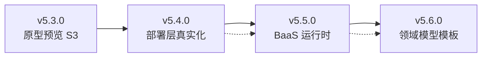

# Arc 投产升级路线图 — 从原型预览到真实可运行应用

> **起点**: v5.3.0（原型预览 S3 持久化）
> **终点**: v5.6.0（真实投产 + 领域模型模板壁垒）
> **参考架构**: XSpace S3+BaaS 方案（验证过的生产级能力）
> **创建日期**: 2026-06-04

---

## 一、全局架构演进图

```
v5.3.0 (当前)                v5.4.0                  v5.5.0                    v5.6.0
─────────────                ──────                  ──────                    ──────
                                                                              
┌─────────────┐        ┌─────────────┐        ┌─────────────┐          ┌─────────────┐
│  原型预览    │   →    │  原型预览    │   →    │  原型预览    │    →     │  原型预览    │
│  (S3 HTML)  │        │  (不变)      │        │  (不变)      │          │  (不变)      │
└─────────────┘        └─────────────┘        └─────────────┘          └─────────────┘
                                                                              
       ✗               ┌─────────────┐        ┌─────────────┐          ┌─────────────┐
  (无真实部署)     →    │  静态部署    │   →    │  静态部署    │    →     │  静态部署    │
                       │  (S3+CDN)   │        │  + BaaS 后端 │          │  + BaaS 后端 │
                       └─────────────┘        └─────────────┘          └─────────────┘
                                                                              
       ✗                      ✗               ┌─────────────┐          ┌─────────────┐
  (无 BaaS)         (无 BaaS)           →    │  Supabase    │    →     │  Supabase    │
                                              │  PG+RLS+API │          │  PG+RLS+API │
                                              └─────────────┘          └─────────────┘
                                                                              
       ✗                      ✗                      ✗               ┌─────────────┐
  (无模板)          (无模板)           (无模板)                  →    │  领域模型    │
                                                                     │  模板库      │
                                                                     └─────────────┘
```

---

## 二、三版本关系与依赖



| 版本 | 关键产出 | 用户感知变化 |
|------|---------|------------|
| v5.4.0 | `deploy()` → 真实 URL 可访问 | "我的应用有了真实地址" |
| v5.5.0 | Supabase provision + 数据读写 | "应用能注册登录、有数据库了" |
| v5.6.0 | 模板匹配 + 一键套用 | "第5个项目创建时，系统推荐了和以前类似的骨架" |

---

## 三、跨版本技术约束

### 3.1 DDD 分层严格遵循

三个版本引入大量新模块，**必须**遵循分层：

| 新模块 | domain 层 | application 层 | infrastructure 层 |
|--------|----------|---------------|-------------------|
| Deployment | entity + value_objects + repository 接口 | DeployService | deployer/static_site.py |
| BaaS | entity + value_objects + repository 接口 | BaasService + DomainModelApplier | baas/supabase_client.py + provisioner + generators |
| Template | entity + value_objects + repository 接口 | ExtractionService + MatchingService + ApplyService | — (复用 baas infra) |

**绝对禁止**: infrastructure 细节（psycopg2、boto3、Supabase SDK）泄漏到 domain 或 application。

### 3.2 DomainModelSnapshot 向后兼容

v5.5.0 扩展 `DomainModelSnapshot.content` 结构时：

```python
# 旧格式（v5.3.0 存量数据）
{"subdomains": [...], "contexts": [...], "aggregates": [...], "relations": [...]}

# 新格式（v5.5.0+）
{
  "subdomains": [...],  # 保持
  "aggregates": [...],  # 保持
  "baas_schema": {       # 新增（可选）
    "tables": [...],
    "policies": [...],
    "transitions": [...],
    "actions": [...]
  }
}
```

**规则**: `baas_schema` 不存在时，所有 BaaS 操作 graceful skip。旧项目无需迁移即可正常工作。

### 3.3 配置项增量

| 版本 | 新增配置项 | .env.example 必须同步 |
|------|-----------|---------------------|
| v5.4.0 | `ARC_DEPLOY_CDN_DOMAIN`, `ARC_DEPLOY_PATH_PREFIX`, `ARC_DEPLOY_MAX_FILE_SIZE` | ✅ |
| v5.5.0 | `ARC_SUPABASE_DB_HOST`, `ARC_SUPABASE_DB_PORT`, `ARC_SUPABASE_DB_USER`, `ARC_SUPABASE_DB_PASSWORD`, `ARC_SUPABASE_JWT_SECRET`, `ARC_SUPABASE_API_URL` | ✅ |
| v5.6.0 | 无新增（复用 Supabase + embedding 配置） | — |

### 3.4 Agent Tool 注册表

| 版本 | 新增 Tools | 阶段绑定 |
|------|-----------|---------|
| v5.4.0 | `deploy_static_site` | DEPLOYMENT |
| v5.5.0 | `supabase_provision`, `supabase_execute_sql`, `supabase_get_domain_model` | ARCHITECTURE, DEVELOPMENT |
| v5.6.0 | `apply_template` | ARCHITECTURE |

### 3.5 前端变更最小化原则

- v5.4.0: 仅改部署状态展示（已有按钮 + 状态轮询）
- v5.5.0: 无前端改动（BaaS 操作全在 Agent 内完成）
- v5.6.0: 新增模板推荐 UI（ARCHITECTURE 阶段侧边栏卡片）

---

## 四、从 XSpace 借鉴的关键能力映射

| XSpace 能力 | Arc 对应实现 | 差异点 |
|------------|-------------|--------|
| `BOSDeployer` (KS3 全量上传) | `infrastructure/deployer/static_site.py` | Arc 走 DDD 分层，不直接在 tool 里写 |
| `supabase/provisioner.py` (schema 创建) | `infrastructure/baas/schema_provisioner.py` | 加元模型表初始化 |
| `_validate_user_owned_table_sql` | `application/baas/rls_validator.py` | 校验逻辑放 application 层 |
| `_meta_entities/_meta_states/_meta_transitions` | `schema_provisioner.py` 自动创建 | 完全复用 XSpace 的表设计 |
| `get_domain_model` tool (Agent 自省) | `supabase_get_domain_model` tool | 同理 |
| Skill 发布 (KS3 + 版本化) | DomainTemplate 发布 (PG embedding) | Arc 不用 .skill 包，用 DB 存 |
| Workspace → App 1:1 绑定 | Project → BaasInstance 1:1 绑定 | schema 命名: `arc_{project_id_short}` |
| `platform-auth` Skill → JWT | Arc auth → Supabase 兼容 JWT | 已有 auth 体系直接扩展 |

---

## 五、风险清单与缓解

| 风险 | 严重度 | 缓解策略 |
|------|--------|---------|
| Supabase 本地环境不稳定 | 高 | v5.4.0 不依赖 Supabase，v5.5.0 用 Docker Compose 固化版本 |
| 增量 DDL 破坏数据 | 高 | sql_generator 不允许 DROP COLUMN，破坏性变更需人工确认 |
| RLS 漏洞 | 高 | rls_validator 做 5 项 XSpace 级校验 + ARCHITECTURE Gate 审批 |
| 模板过度泛化不实用 | 中 | 保留 source 追溯 + usage_count 统计 + 用户反馈降 confidence |
| 领域模型格式不稳定 | 中 | baas_schema 字段可选、版本化、旧格式 graceful fallback |
| 工程量大交付拖期 | 中 | 严格版本切割，v5.4.0 独立可验证，不 block 日常使用 |

---

## 六、验证策略

### v5.4.0 验证（自己验证）

用 Arc 的 PIPELINE 模式创建一个简单需求 → 走完到 DEPLOYMENT 阶段 → 确认生成了 dist → S3 有文件 → URL 能打开。

### v5.5.0 验证（自己验证）

用 Arc 创建一个"待办管理应用" → ARCHITECTURE 阶段产出领域模型（Todo 实体+状态机） → 确认 Supabase 建了表+RLS → 前端能通过 PostgREST 增删改查。

### v5.6.0 验证（经验壁垒验证）

上一步完成后再创建"需求管理应用" → 系统推荐"待办管理"的模板 → 套用 → 确认表结构合理且无需从头建模。

---

## 七、工作量估算

| 版本 | 后端 | 前端 | 测试 | 配置/迁移 | 总计 |
|------|------|------|------|----------|------|
| v5.4.0 | ~3h | ~0.5h | ~1h | ~0.5h | **~5h** |
| v5.5.0 | ~6h | ~0.5h | ~2h | ~1h | **~9.5h** |
| v5.6.0 | ~4h | ~1.5h | ~1.5h | ~0.5h | **~7.5h** |

**总计 ~22h**，按每天 4h 有效开发时间，约 5-6 天完成三个版本。

---

## 八、执行顺序建议

1. **v5.3.0 归档** → 质量检测 → snapshot
2. **v5.4.0 激活** → T1(存储) → T2(领域) → T8(测试) → T3(infra) → T4(service) → T5(hook) → T6/T7(配置/迁移) → T9(集成测试)
3. **v5.4.0 完成** → 本地 MinIO 验证 → 归档
4. **v5.5.0 激活** → 环境准备(docker-compose supabase) → 领域→infra→service→tool→hook → 验证
5. **v5.5.0 完成** → "待办管理应用"端到端验证 → 归档
6. **v5.6.0 激活** → 模板提取→匹配→套用 → "需求管理应用"冷启动验证 → 归档
